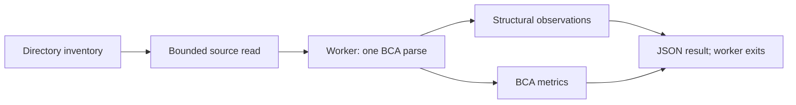

# Structural analysis prototype

This experiment tests whether dircue can offer optional syntax-based observations
and [BCA](https://github.com/dekobon/big-code-analysis) metrics without parsing
each file twice. It targets Java and C# first. It is separate from the released
`dircue` CLI and does not change its commands, dependencies, or JSON schemas.
The [production isolation check](tests/results/production-isolation.json) records
a byte-identical rebuild of the v0.2.0 Go binary and passing root tests.

## What it does

A standalone Go driver walks a directory and sends eligible files to a Rust
worker. BCA owns each Tree-sitter parse. A small structural visitor and BCA's
metric walker borrow that same tree, then the process exits. The driver writes
one JSON record per file and a final summary without retaining all file results.



The structural visitor counts declarations, imports, lambdas, and syntax errors.
It does not resolve types, symbols across files, project references, or compiler
conditional configurations. BCA supplies aggregate file metrics, including its
complexity measures. These are observations with language-specific definitions,
not judgments of code quality.

The worker has one parser entry point: `Ast::parse`. `Ast::as_tree_sitter` supplies
the structural visitor, and `Ast::metrics` reuses the held parse. Instrumentation
records calls to that entry point. Tests also compare combined results with
separate `structure` and `metrics` runs. Tree reuse avoids a second parse; each
consumer still traverses the tree.

## Try it

Build requirements: Go 1.24 or newer, Rust 1.94 or newer, and a C compiler.
Dependencies are fetched at build time. Prebuilt driver and worker executables
need no compiler, network, grammar download, or Git repository at runtime.

From the repository root:

```sh
make -C prototypes/structural demo
```

That builds both executables and runs the checked-in fixtures. To inspect a
stable checkout or extracted directory:

```sh
prototypes/structural/bin/dircue-structural-prototype \
  --worker prototypes/structural/worker/target/release/dircue-structural-worker \
  /path/to/source
```

If using rustup with multiple toolchains, pass `CARGO='cargo +1.94.0'` to `make`.
The [driver documentation](driver/README.md) covers flags, JSON Lines, scope,
partial results, and exit codes. The prototype's interface is not yet stable.

## Scope and resource behavior

Only `.java` and `.cs` files are selected. XML and other extensions are ignored
without reading their contents. Hidden directories and common dependency/build
directories are pruned. This is a live directory experiment: it does not reuse
production dircue's Git-tree selection, generated-file rules, or `.gitattributes`
semantics. Those contracts must be integrated before shipping a production module.

Files must be valid UTF-8, contain no NUL bytes, and fit the 8 MiB source limit.
The driver invokes one worker at a time, with a 10-second default timeout and
bounded output capture. Each process owns one tree and exits before the next.
That limits concurrent analysis and avoids retaining trees across files.
It does not guarantee a fixed RSS ceiling: tree size and metric state depend on
syntax. Directory enumeration also retains each directory's entry list for
sorted traversal. Worker timeouts do not bound filesystem I/O. Use a stable
checkout and an OS/container limit when hard resource enforcement is needed.

Starting a process per file costs time. This choice makes parse ownership,
cancellation, and cleanup easy to verify. A persistent worker with explicit
per-file teardown is a possible later optimization, subject to measurement.

Syntax errors produce `partial` observations rather than a successful full-parse
claim. In the initial 150-file public-project sample, three Roslyn files produced
syntax errors. Preprocessor directives contributed to two; the third uses
[C# 14 null-conditional assignment](https://learn.microsoft.com/en-us/dotnet/csharp/language-reference/proposals/csharp-14.0/null-conditional-assignment),
which the pinned grammar does not parse correctly. Full compiler validity and Tree-sitter parse success are different
properties. See the [test report](tests/README.md) for exact paths and measurements.

## Verify it

```sh
make -C prototypes/structural build test
python3 prototypes/structural/tests/validate.py \
  --worker prototypes/structural/worker/target/release/dircue-structural-worker \
  --driver prototypes/structural/bin/dircue-structural-prototype \
  --output prototypes/structural/results/local/validation.json

docker build -t dircue-structural-prototype:local prototypes/structural
python3 prototypes/structural/tests/offline.py \
  --output prototypes/structural/results/local/offline.json
```

To include the Go driver in that container check, build it with
`GOOS=linux GOARCH=arm64 CGO_ENABLED=0 go build -trimpath -o ../bin/driver-linux .`
from `prototypes/structural/driver`, then add
`--driver prototypes/structural/bin/driver-linux` to the test command from the
repository root. Use `GOARCH=amd64` when the Docker image targets AMD64 instead.

The Docker test runs a prebuilt Linux worker as an unprivileged user, with a
read-only filesystem, no network, and an enforced 256 MiB container limit.
It verifies those inputs within that limit; it does not establish that every
8 MiB input fits. The test reports a null peak when the host kernel does not
expose `memory.peak`, rather than estimating one. Native benchmarks measure RSS
separately. The [dependency notes](DEPENDENCIES.md) record parser pins and licenses.

## Recommendation

For Java and C#, BCA can own the parse and serve additional structural consumers.
A separate top-level Tree-sitter pass is unnecessary for this design. Do not add
the full language pack as a prerequisite: its grammar identities must match any
metric consumer, and broader grammar coverage needs its own use cases and tests.

Before a production release, integrate the shared file inventory and scope rules,
settle the optional worker's packaging and update policy, investigate the C#
coverage gaps, and define a versioned result contract. Measure larger and more
varied inputs under deployment resource limits. Preserve the current language-only
and scc paths while that work proceeds.
